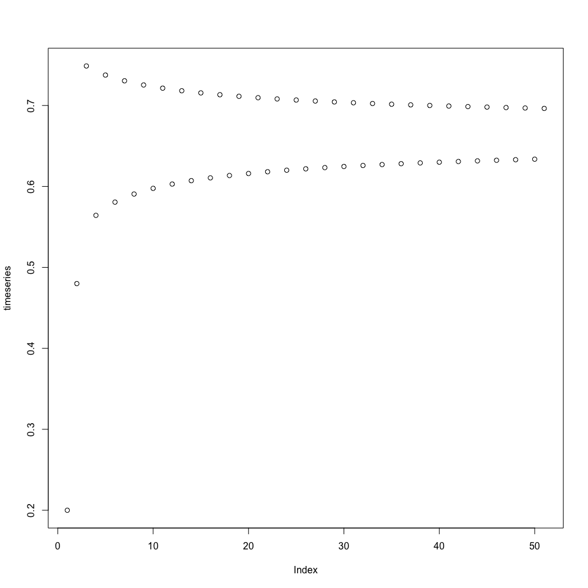
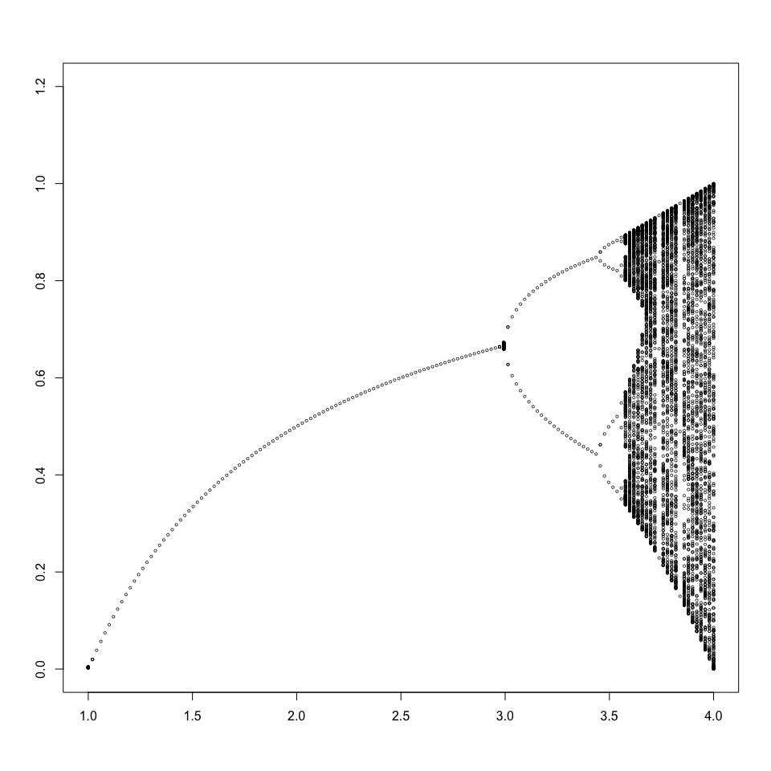
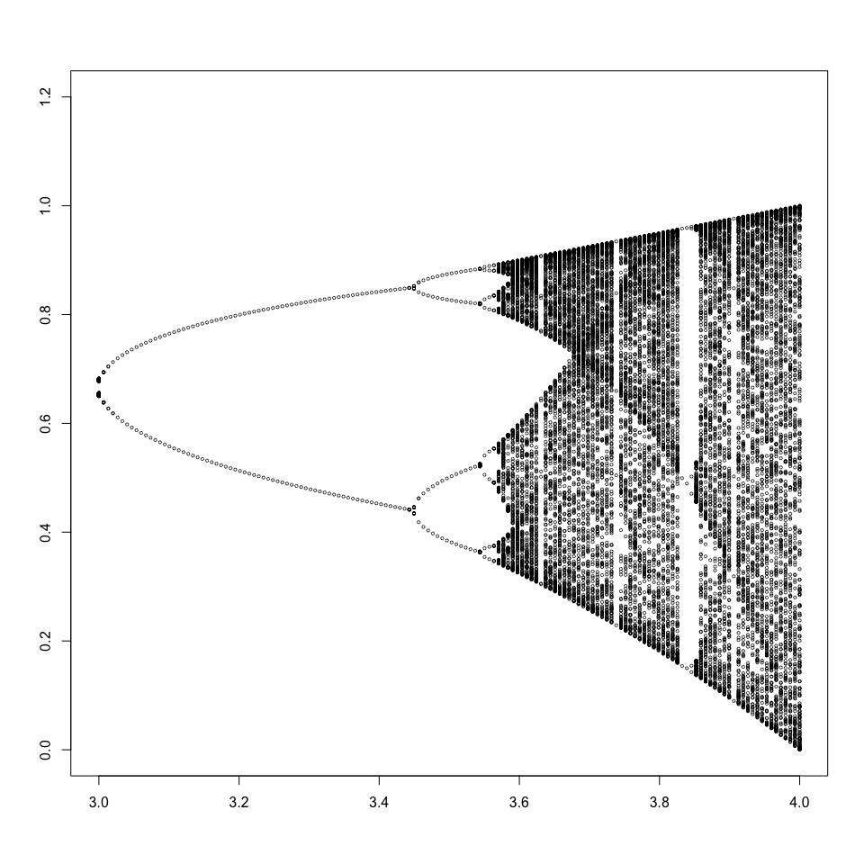
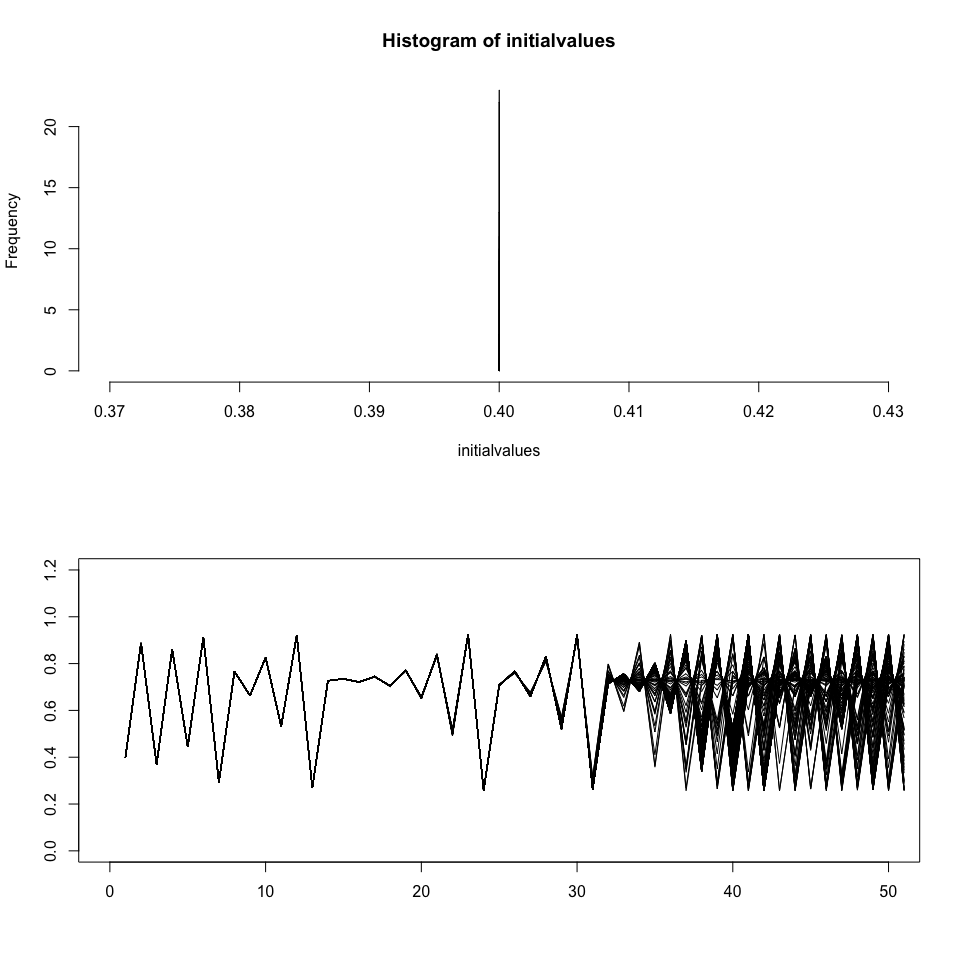

# Chaos in the logistic map
Florian Hartig  
`r format(Sys.Date(), "%B %d, %Y")`  


```r
logisticMap <- function (N0 = 0.2, r=1.7, timesteps = 50){
  
  popdyn <- c(N0, rep(NA, timesteps))
  
  for (i in 1:timesteps){
    popdyn[i+1] <- r *  popdyn[i] * (1 - popdyn[i] ) 
  }
  return(popdyn)          
}


# try out e.g. r = 0.5, 1.5. 2.4, 2.8, 3.5

timeseries <- logisticMap(r=3)


plot(timeseries)
```



## bifurcation diagram


```r
plot(0,0, xlim = c(1,4), ylim = c(0,1.2), col = "white", xlab = "", ylab = "")

for (r in seq(1,4, length.out=150)){
  values = unique(round(logisticMap(r = r, timesteps = 500)[200:500], digits = 4)) 
  points(rep(r, length(values)), values, cex = 0.45, lwd = 0.6)
}
```




```r
# zooming into the interesting parameter space

plot(0,0, xlim = c(3,4), ylim = c(0,1.2), col = "white", xlab = "", ylab = "")

for (r in seq(3,4, length.out=150)){
  values = unique(round(logisticMap(r = r, timesteps = 500)[200:500], digits = 4)) 
  points(rep(r, length(values)), values, cex = 0.45, lwd = 0.6)
}
```




## Dynamics


```r
initialvalues = rnorm(100,0.4,0.000001)

par(mfrow = c(2,1))

hist(initialvalues, xlim = c(0.37,0.43))

plot(0,0, xlim = c(0,50), ylim = c(0,1.2), col = "white", xlab = "", ylab = "")

for (N in initialvalues){
  lines(logisticMap(N, r = 3.7, timesteps = 50))
}
```



