# Methoden für globale Sensitivitätsanalyse
Florian Hartig  
13 Jul 2015  


```r
library(sensitivity)
```

```
## Warning: package 'sensitivity' was built under R version 3.1.3
```


# Test funktion

The function of Ishigami


```r
ishigami.fun
```

```
## function (X) 
## {
##     A <- 7
##     B <- 0.1
##     sin(X[, 1]) + A * sin(X[, 2])^2 + B * X[, 3]^4 * sin(X[, 
##         1])
## }
## <environment: namespace:sensitivity>
```


Scatterplots for the Ishigami function versus X1, X2 and X3


```r
n <- 2000
x <- matrix(nr = n, nc = 3)
for (i in 1:3)
x[, i] <- runif(n, min = -pi, max = pi)
y <- ishigami.fun(x)
plot(x[, 1], y)
```

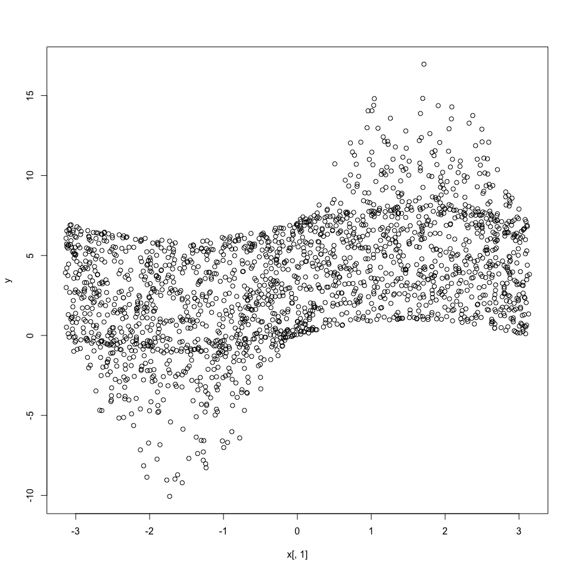

```r
plot(x[, 2], y)
```

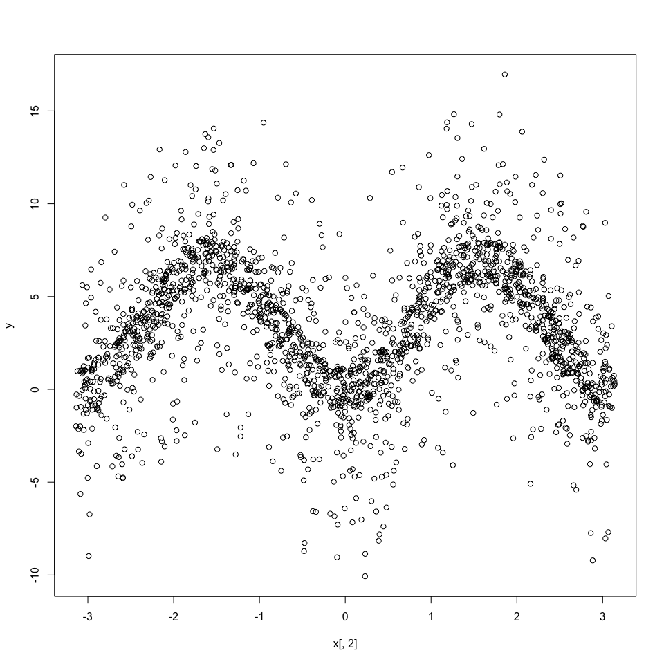

```r
plot(x[, 3], y)
```

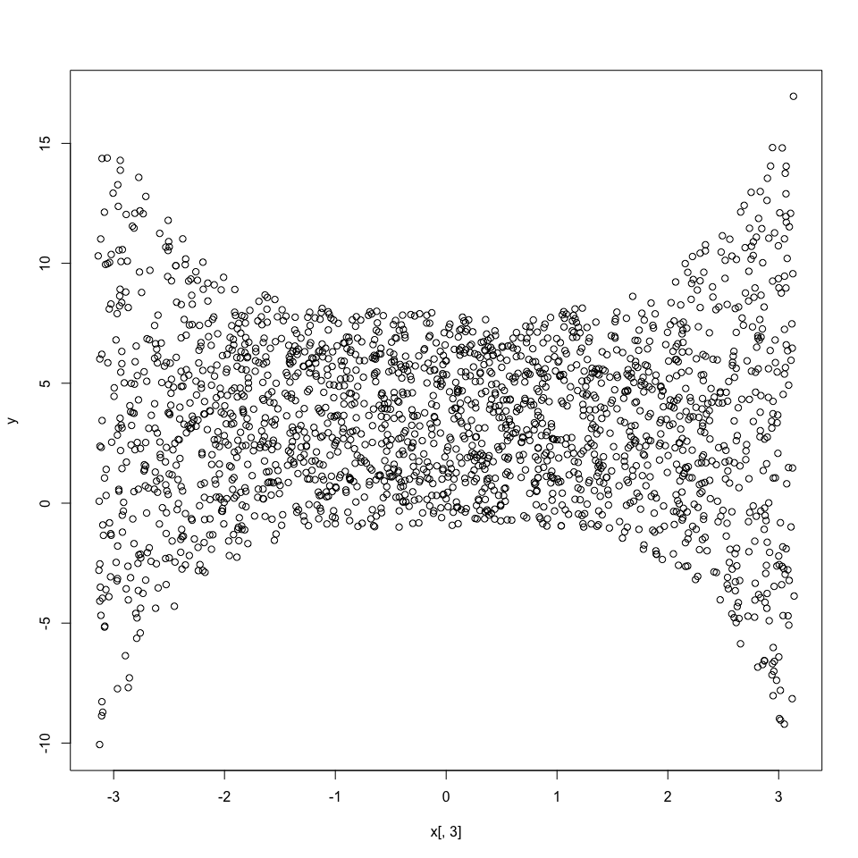

NOTE: the function has 3 parameters, but I will use it with 4 below, so the 4th parameter has absolutely no effect on the output!

# Lokale SA

Only for par 2


```r
n <- 2000
x <- matrix(nr = n, nc = 3)
x[,1] = 1.5
x[, 2] <- runif(n, min = -pi, max = pi)
x[, 3] <- 1.5
y <- ishigami.fun(x)
plot(x[, 2], y)
```

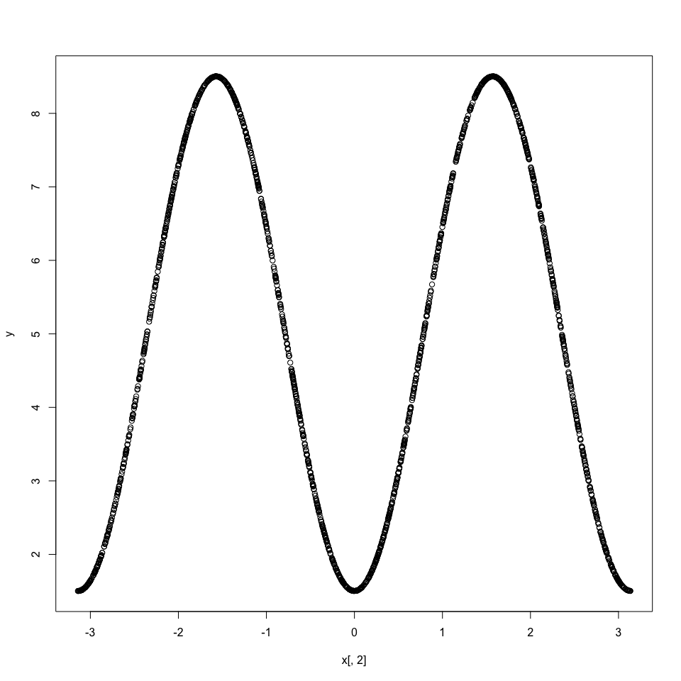

Note that your sensitivity coefficients for x2 would depend on your choice of the distance e.g. (+- 10%) as well as on your choice of default


# Global methods


## Morris Screening

Morris implements the Morris's elementary effects screening method (Morris 1992). This method, based on design of experiments, allows to identify the few important factors at a cost of r * (p + 1) simulations (where p is the number of factors). This implementation includes some improvements of the original method: space-filling optimization of the design (Campolongo et al. 2007) and simplex-based design (Pujol 2009).


```r
morrisOut <- morris(model = ishigami.fun, factors = 4, r = 10,
            design = list(type = "oat", levels = 10, grid.jump = 5), bsup = 3)
print(morrisOut)
```

```
## 
## Call:
## morris(model = ishigami.fun, factors = 4, r = 10, design = list(type = "oat",     levels = 10, grid.jump = 5), bsup = 3)
## 
## Model runs: 50 
##             mu  mu.star    sigma
## X1  1.00922132 1.161603 1.477839
## X2 -0.02344316 2.787552 3.134441
## X3  1.15800868 1.158009 1.069161
## X4  0.00000000 0.000000 0.000000
```

```r
plot(morrisOut)
```

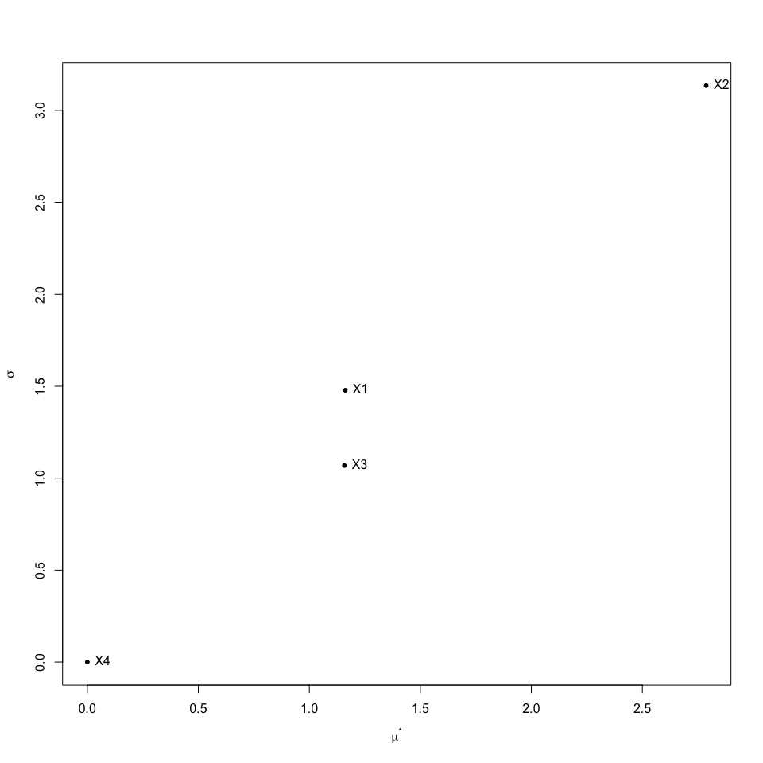


## Sobol 


Sobol implements the Monte Carlo estimation of the Sobol' sensitivity indices. This method allows the estimation of the indices of the variance decomposition, sometimes referred to as functional ANOVA decomposition, up to a given order, at a total cost of (N + 1) * n where N is the number of indices to estimate. This function allows also the estimation of the so-called subset indices, i.e. the first-order indices with respect to single multidimensional inputs.


```r
n <- 1000
X1 <- data.frame(matrix(runif(4 * n, max = 3), nrow = n))
X2 <- data.frame(matrix(runif(4 * n, max = 3), nrow = n))

sobolOut <- sobol(model = ishigami.fun, X1, X2, order = 2, nboot = 100)

print(sobolOut)
```

```
## 
## Call:
## sobol(model = ishigami.fun, X1 = X1, X2 = X2, order = 2, nboot = 100)
## 
## Model runs: 11000 
## 
## Sobol indices
##          original          bias std. error   min. c.i. max. c.i.
## X1     0.03275731  0.0012970721 0.08492143 -0.14752984 0.2334635
## X2     0.71501667 -0.0009775487 0.06131486  0.60074795 0.8416107
## X3     0.23618567 -0.0058126690 0.07972994  0.07595316 0.3766156
## X4     0.01435923 -0.0015556036 0.08594343 -0.14738875 0.2405934
## X1*X2 -0.01435923  0.0015556036 0.08594343 -0.24059336 0.1473888
## X1*X3  0.03367376  0.0039559398 0.09565451 -0.18589998 0.2421761
## X1*X4 -0.01435923  0.0015556036 0.08594343 -0.24059336 0.1473888
## X2*X3 -0.01435923  0.0015556036 0.08594343 -0.24059336 0.1473888
## X2*X4 -0.01435923  0.0015556036 0.08594343 -0.24059336 0.1473888
## X3*X4 -0.01435923  0.0015556036 0.08594343 -0.24059336 0.1473888
```

```r
plot(sobolOut)
```


## Standardized Regression Coefficients

src computes the Standardized Regression Coefficients (SRC), or the Standardized Rank Regression Coefficients (SRRC), which are sensitivity indices based on linear or monotonic assumptions in the case of independent factors.


```r
n <- 1000
X <- data.frame(matrix(runif(4 * n, max = 3), nrow = n))
y <-ishigami.fun(X)


x1 <- src(X, y, nboot = 100, rank = F)
print(x1)
```

```
## 
## Call:
## src(X = X, y = y, rank = F, nboot = 100)
## 
## Standardized Regression Coefficients (SRC):
##       original          bias std. error    min. c.i.  max. c.i.
## X1  0.04485767 -0.0021647077 0.02780820 -0.005122599 0.10451936
## X2  0.05333264  0.0001945107 0.03145156 -0.004986685 0.13306162
## X3  0.43395398 -0.0015510835 0.02482392  0.390406295 0.49054643
## X4 -0.00187488 -0.0002575084 0.02928849 -0.070135849 0.05420753
```

```r
plot(x1)
```

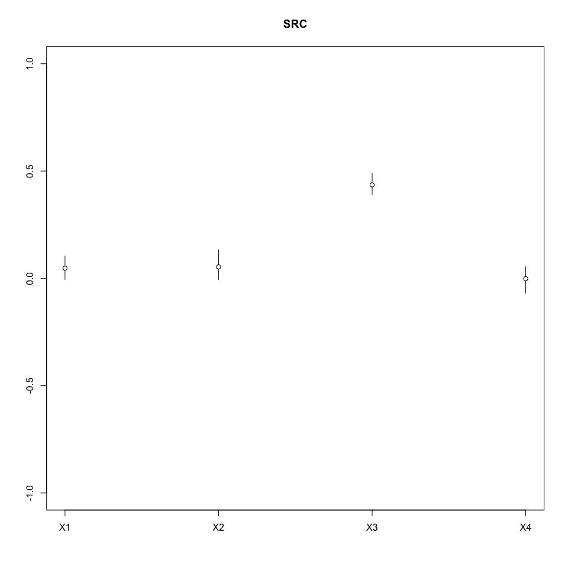

```r
x2 <- src(X, y, nboot = 100, rank = T)
print(x2)
```

```
## 
## Call:
## src(X = X, y = y, rank = T, nboot = 100)
## 
## Standardized Rank Regression Coefficients (SRRC):
##       original          bias std. error    min. c.i.  max. c.i.
## X1 0.039890609  3.557477e-04 0.03290153 -0.033130104 0.10307368
## X2 0.057948408 -7.630418e-04 0.03087736 -0.004228945 0.12302262
## X3 0.394768196  3.269045e-05 0.02662099  0.342505172 0.44881294
## X4 0.005257132 -3.320376e-03 0.02765805 -0.050121426 0.05862282
```

```r
plot(x2)
```

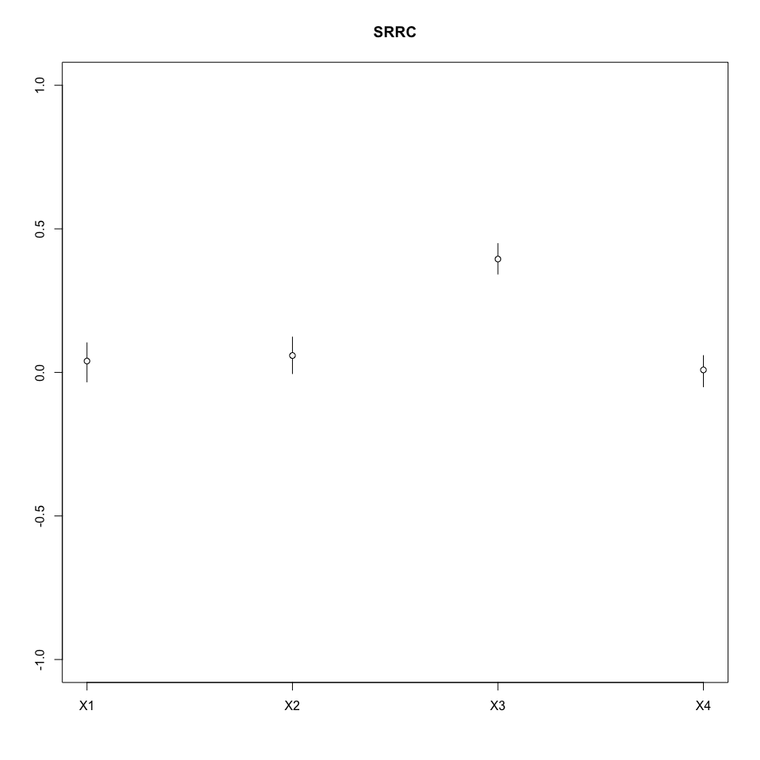

pcc computes the Partial Correlation Coefficients (PCC), or Partial Rank Correlation Coefficients (PRCC), which are sensitivity indices based on linear (resp. monotonic) assumptions, in the case of (linearly) correlated factors.


```r
x1 <- pcc(X, y, nboot = 100, rank = F)
print(x1)
```

```
## 
## Call:
## pcc(X = X, y = y, rank = F, nboot = 100)
## 
## Partial Correlation Coefficients (PCC):
##        original          bias std. error   min. c.i.  max. c.i.
## X1  0.049666796  0.0091699305 0.03104982 -0.02645866 0.09416513
## X2  0.059169896  0.0023980983 0.03387666 -0.00723769 0.12355085
## X3  0.434570297 -0.0017876084 0.02220833  0.39471610 0.47610909
## X4 -0.002079105  0.0005788394 0.03082109 -0.06480104 0.05568463
```

```r
plot(x1)
```

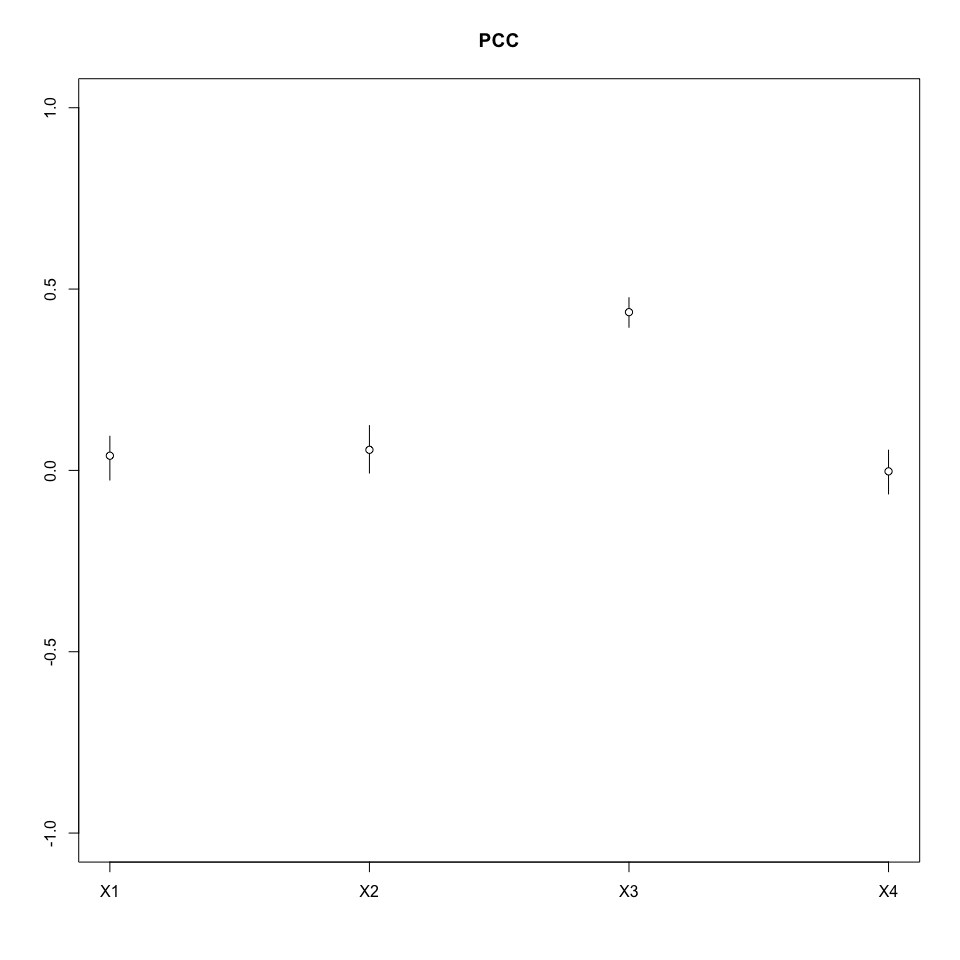

```r
x2 <- pcc(X, y, nboot = 100, rank = T)
print(x2)
```

```
## 
## Call:
## pcc(X = X, y = y, rank = T, nboot = 100)
## 
## Partial Rank Correlation Coefficients (PRCC):
##       original         bias std. error   min. c.i.  max. c.i.
## X1 0.043322849 0.0015508723 0.03309854 -0.02057495 0.10783345
## X2 0.063033673 0.0033307927 0.03552769 -0.01333058 0.13401501
## X3 0.395376293 0.0025405715 0.02578968  0.33908746 0.44416169
## X4 0.005716364 0.0002395871 0.02973308 -0.05189320 0.06604114
```

```r
plot(x2)
```

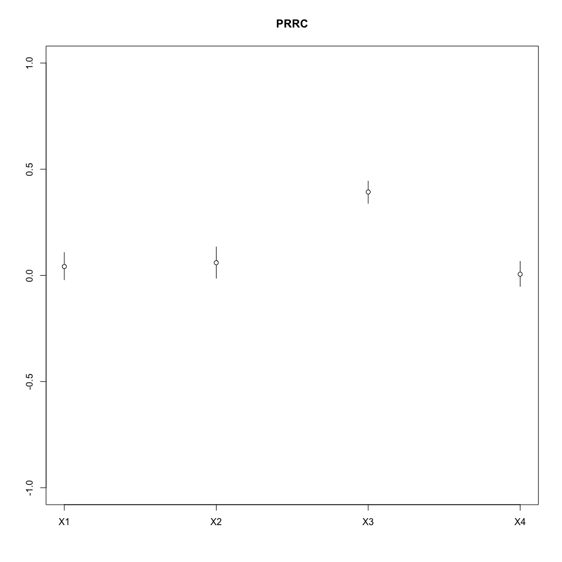


## Delsa

Delsa implements Distributed Evaluation of Local Sensitivity Analysis to calculate first order parameter sensitivity at multiple locations in parameter space. The locations in parameter space can either be obtained by a call to parameterSets or by specifying X0 directly, in which case the prior variance of each parameter varprior also needs to be specified. Via plot (which uses functions of the package ggplot2 and reshape2), the indices can be visualized. 


```r
# Test case : the non-monotonic Sobol g-function
# (there are 8 factors, all following the uniform distribution on [0,1])

## Not run: 
library(sensitivity)
library(randtoolbox)
x <- delsa(model=ishigami.fun,
           par.ranges=replicate(4,c(0,3),simplify=FALSE),
           samples=100,method="sobol")

# Summary of sensitivity indices of each parameter across parameter space
print(x)
```

```
## 
## Call:
## delsa(model = ishigami.fun, par.ranges = replicate(4, c(0, 3),     simplify = FALSE), samples = 100, method = "sobol")
## 
## Locations calculated: 100 
## 
## Model runs: 500 
## 
## Summary of first order indices across parameter space:
##        V1                  V2                 V3                  V4   
##  Min.   :0.0000099   Min.   :0.001258   Min.   :0.0000000   Min.   :0  
##  1st Qu.:0.0111419   1st Qu.:0.488347   1st Qu.:0.0004725   1st Qu.:0  
##  Median :0.0353516   Median :0.897377   Median :0.0221995   Median :0  
##  Mean   :0.1408870   Mean   :0.720395   Mean   :0.1387175   Mean   :0  
##  3rd Qu.:0.1716271   3rd Qu.:0.978594   3rd Qu.:0.1661203   3rd Qu.:0  
##  Max.   :0.9653660   Max.   :0.999870   Max.   :0.9742428   Max.   :0
```

```r
library(ggplot2)
```

```
## Warning: package 'ggplot2' was built under R version 3.1.3
```

```r
library(reshape2)
plot(x)
```

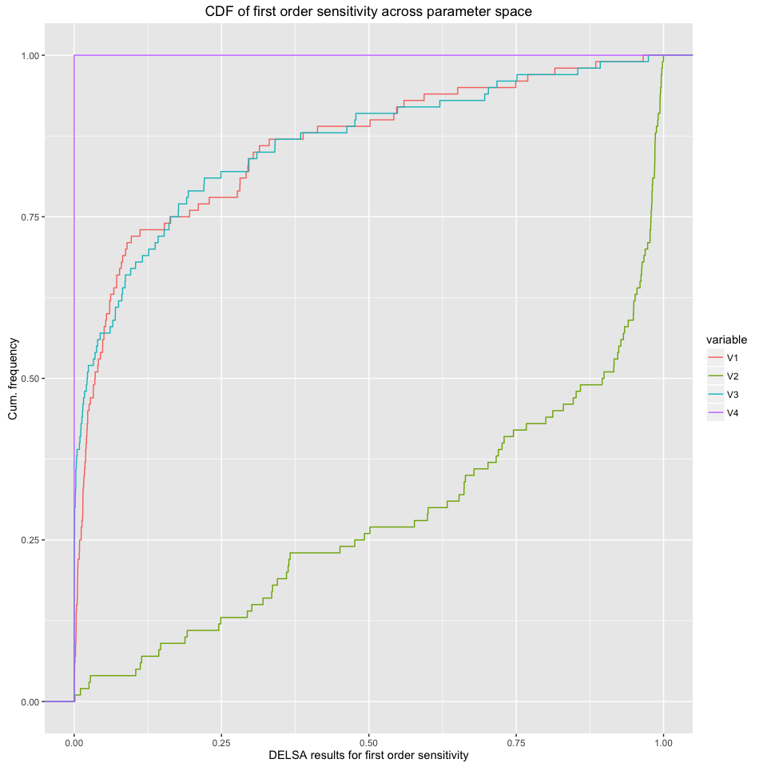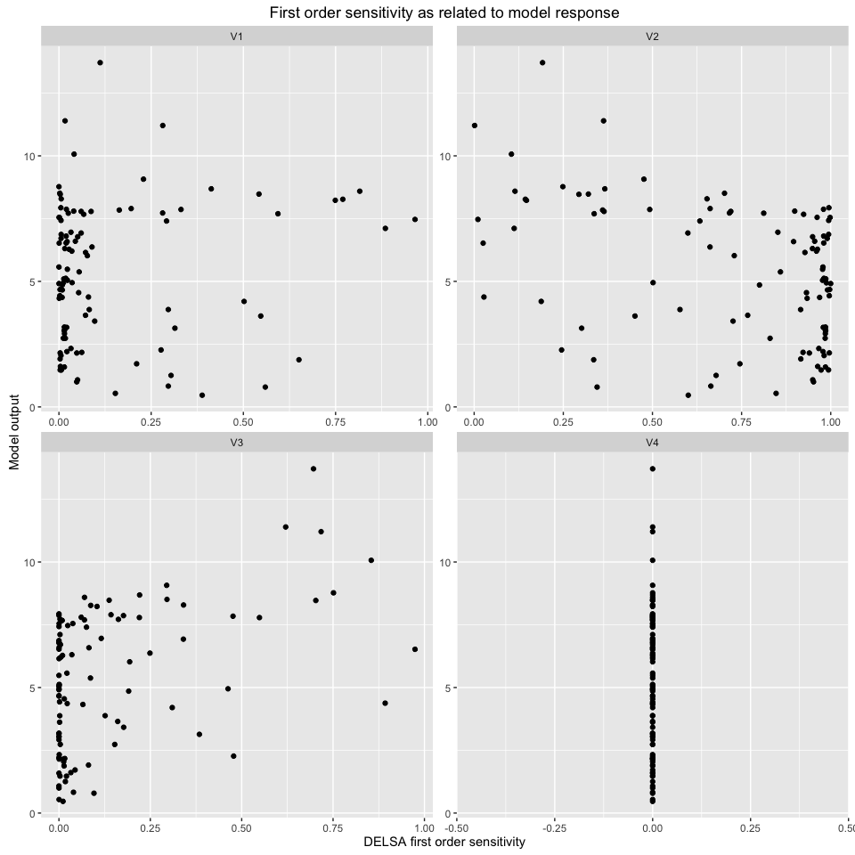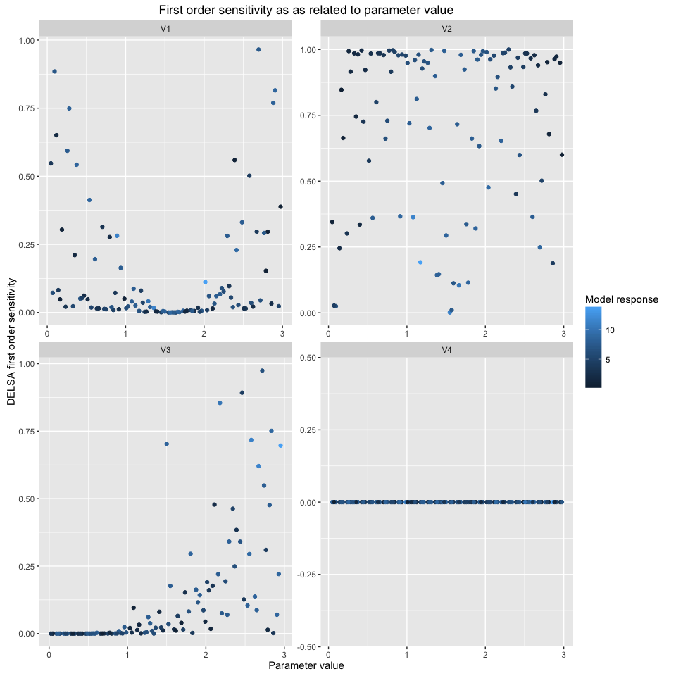


