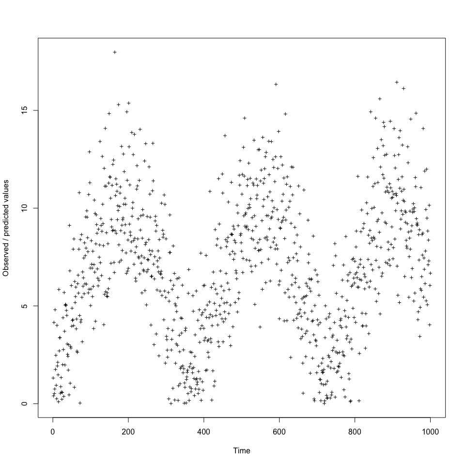
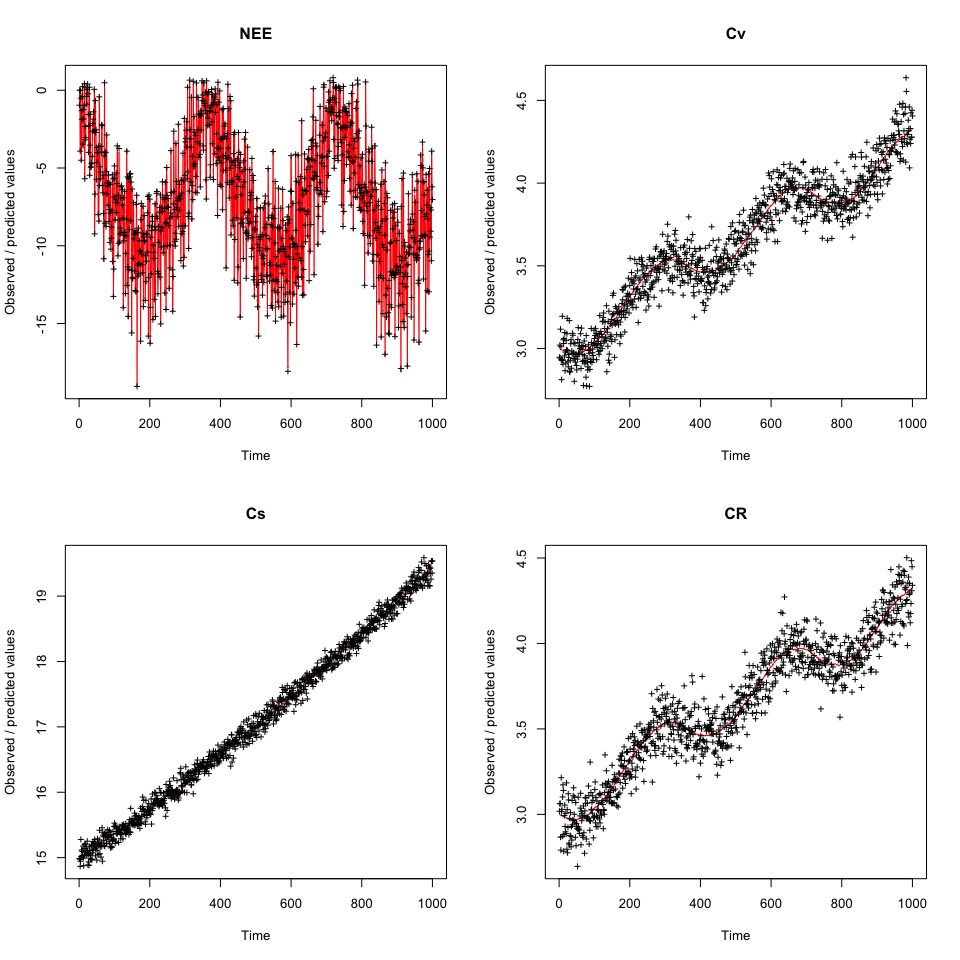
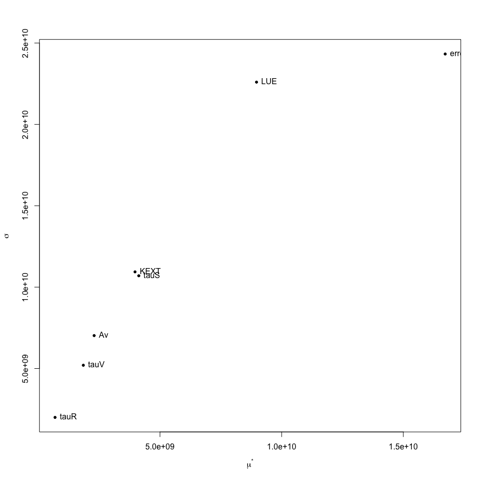
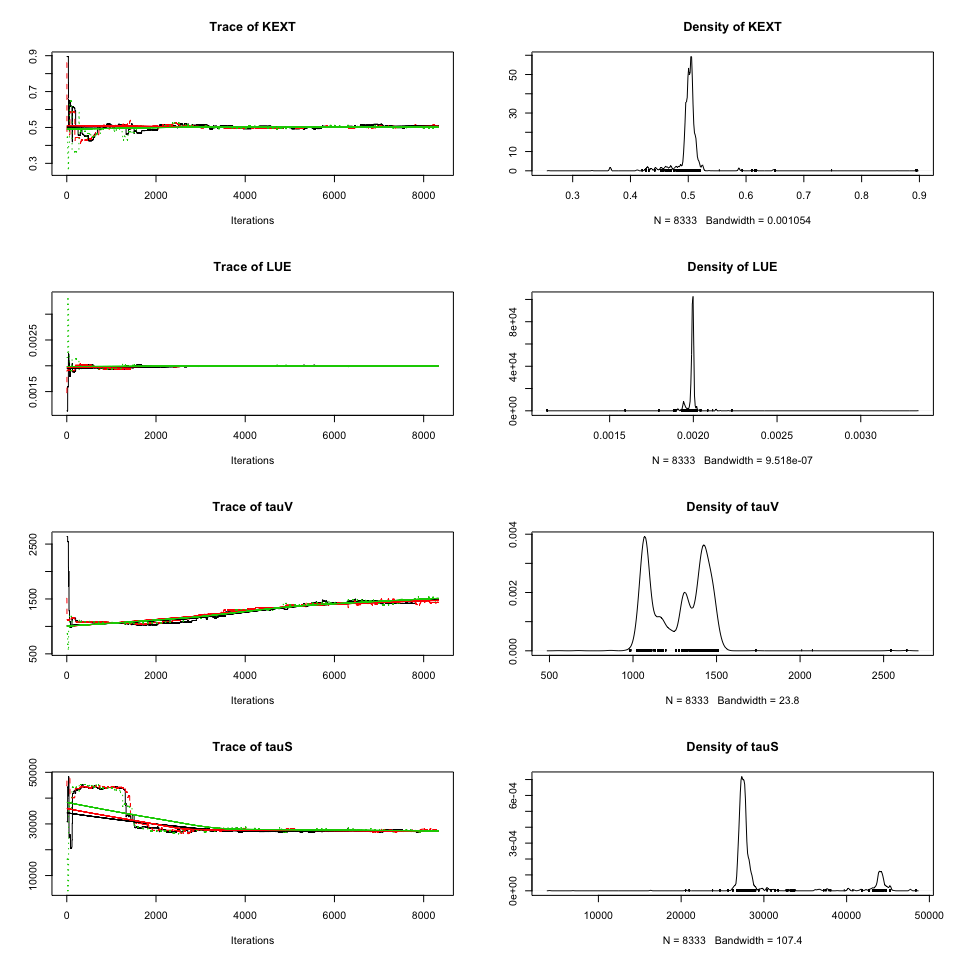
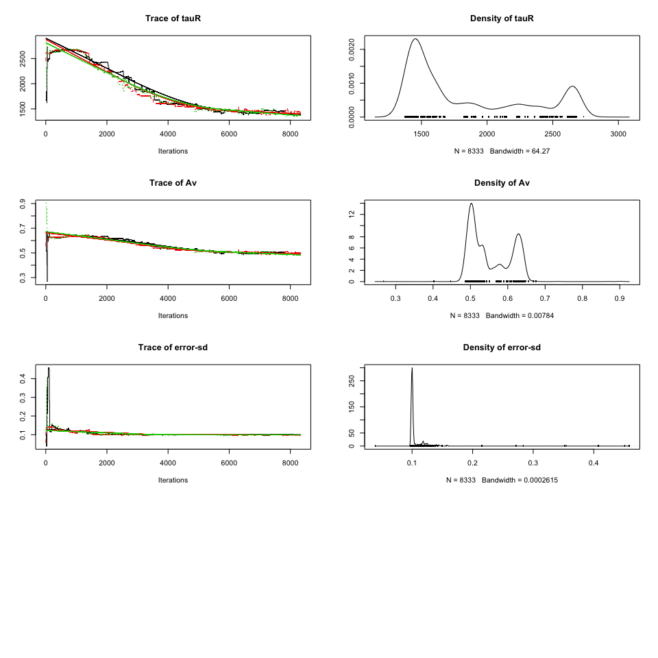
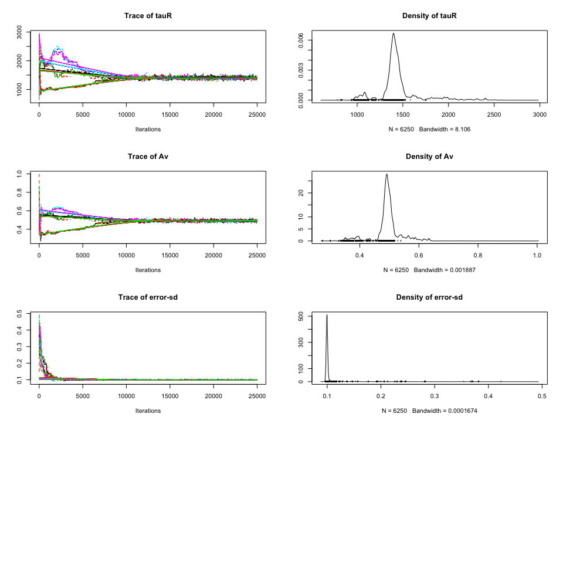
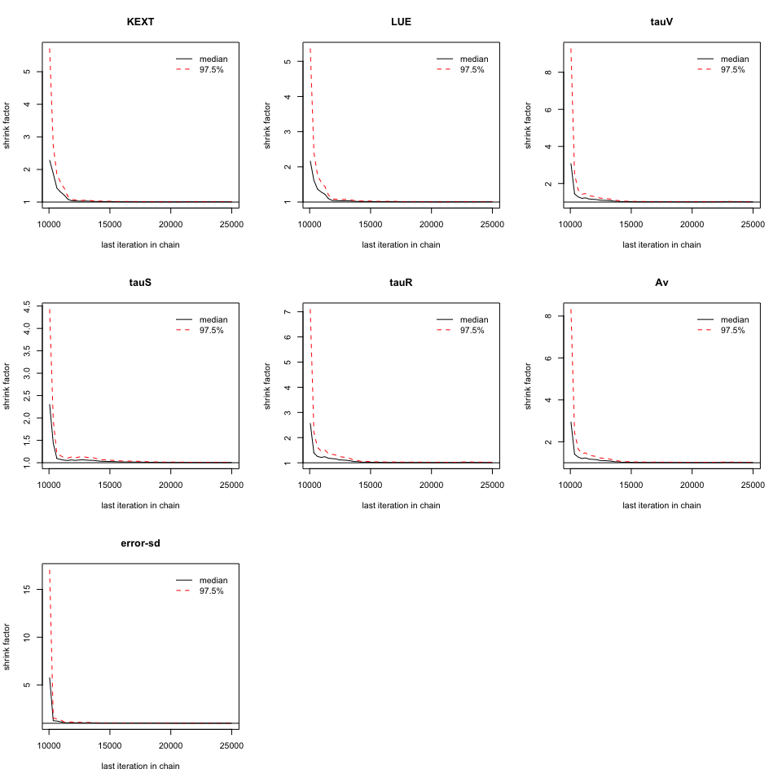
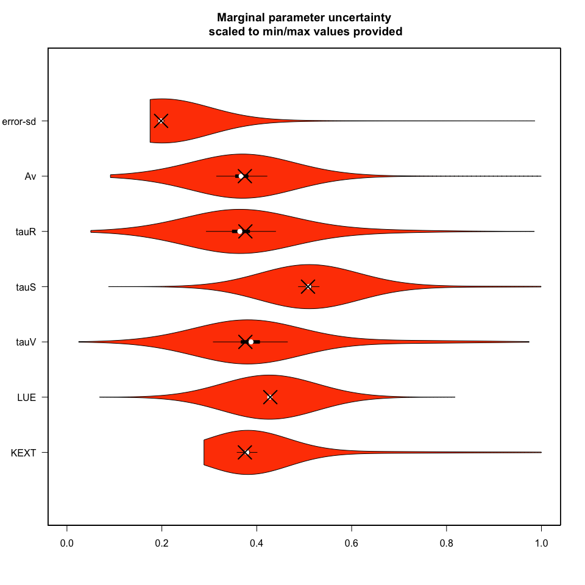
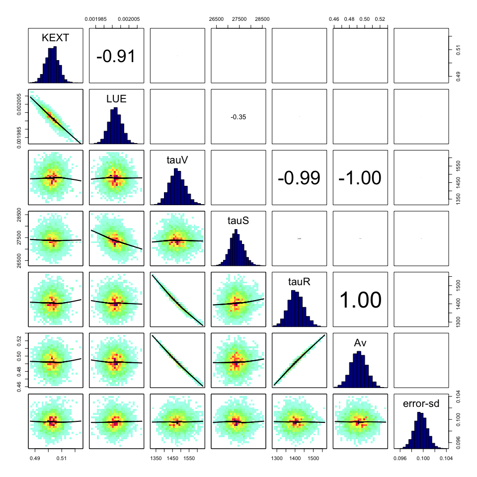
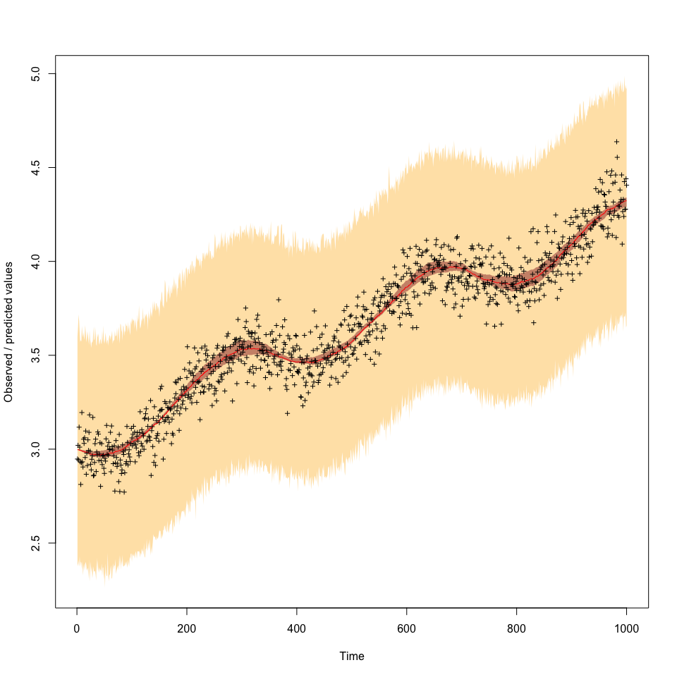

# VSEM calibration
Florian Hartig  


# The Bayesian Tools package

This section will use the BayesianTools package, a package that provides a number of methods for Bayesian model estimation. Load the package in R via


```r
library(BayesianTools)
```

If you use it for the first time, have a look at the help pages


```r
?BayesianTools
```

and in particular the vignettes of the package. You can load the basic quickstart vignette of the package via


```r
vignette("AQuickStart")
```

An overview of the other available vignettes is available via 

A hint for the future: Bayesian inference nearly always uses stochastic (Monte-Carlo) algorithms\marginnote{A Monte-Carlo algorithm solves a numerical problem (e.g. integration of a function) through a stochastic approach. If you work with stochastic algorithms, you should fix the random seed to ensure reproducibility.} to estimate parametric uncertainties. To make the outputs of these algorithms reproducible, we should fix or record the random seed in R


```r
set.seed(123)
```

# The Very Simple Ecosystem Model (VSEM)

Throughout most of this tutorial, we will use the Very Simple Ecosystem Model (VSEM)\marginnote{If you want to run the examples here with your own model, you need to make it callable from R. How to do this is explained in more detail in chapter~\ref{ch: interfacing the model}.}, a model that is provided in the BayesianTools package. The VSEM is a 'toy' model designed to be very simple but yet bear some resemblance to deterministic processed based ecosystem models that are commonly used in vegetation modelling.

The model determines the accumulation of carbon in the plant and soil from the growth of the plant via photosynthesis and senescence to the soil which respires carbon back to the atmosphere.

Gross Primary Productivity (GPP) is calculated using a very simple light-use efficiency (LUE) formulation multiplied by light interception. Light interception is calculated via Beer's law with a constant light extinction coefficient operating on Leaf Area Index (LAI).

A parameter (GAMMA) determines the fraction of GPP that is autotrophic respiration. The Net Primary Productivity (NPP) is then allocated to above and below-ground vegetation via a fixed allocation fraction. Carbon is lost from the plant pools to a single soil pool via fixed turnover rates. Heterotrophic respiration in the soil is determined via a soil turnover rate. The model time-step is daily.

Parameters and state variables of the model are described in


```r
?VSEM
```

To demonstrate the functioning of the model, we use the VSEMcreatePAR() function to create a synthetic radiation (PAR) time series. We visualize the time series using the plotTimeSeries() function from the BayesianTools package.


```r
PAR <- VSEMcreatePAR(1:1000)
plotTimeSeries(observed = PAR)
```



To run the model, we also need parameters. The following function obtains a list of standard parameter values, together with their upper and lower limits for calibration. To these we add an additional parameter for the standard deviation of the observation error that we will add to our data (error-sd). 


```r
refPars <- VSEMgetDefaults()
refPars[12,] <- c(0.1, 0.001, 0.5)
rownames(refPars)[12] <- "error-sd"
refPars
```

```
##               best lower upper
## KEXT         0.500 2e-01 1e+00
## LAR          1.500 2e-01 3e+00
## LUE          0.002 5e-04 4e-03
## GAMMA        0.400 2e-01 6e-01
## tauV      1440.000 5e+02 3e+03
## tauS     27370.000 4e+03 5e+04
## tauR      1440.000 5e+02 3e+03
## Av           0.500 2e-01 1e+00
## Cv           3.000 0e+00 4e+02
## Cs          15.000 0e+00 1e+03
## Cr           3.000 0e+00 2e+02
## error-sd     0.100 1e-03 5e-01
```

Using the reference parameters, we create a model prediction (referenceData) and observations (obs).


```r
referenceData <- VSEM(refPars$best[1:11], PAR) 
referenceData[,1] = 1000 * referenceData[,1]
obs <- referenceData + rnorm(length(referenceData), sd = refPars$best[12])
oldpar <- par(mfrow = c(2,2))
for (i in 1:4) plotTimeSeries(observed = obs[,i], predicted = referenceData[,i], main = colnames(referenceData)[i])
```



# Calibrating the VSEM - a teaser

As a teaser of the rest of this tutorial, we will show a number of options to calibrate the model to the synthetically created observations (assuming that the true parameters were not known to us). We will calibrate 7 parameters. Six parameters of the VSEM, and the standard deviation of the observation error - let's store their index numbers already:


```r
parSel = c(1,3,5:8, 12)
```

\subsection{The likelihood function}

To be able to calibrate a model, we need a calibration target, i.e. the distance between model and data. For statistical calibration, this is always the likelihood, defined as $p(data | model, parameters)$. This conditional probability is calculated based on a probability distribution that the user has to specify. Details are discussed in section~\ref{ch: likelihood}, see also \citep{Hartig-Connectingdynamicvegetation-2012}.

For this example, we use a normal likelihood, but we discuss in the later section~\ref{ch: likelihood} why this often is not an optimal choice and how we can do better. 


```r
likelihood <- function(x, sum = TRUE){
  x <- createMixWithDefaults(x, refPars$best, parSel)
  predicted <- VSEM(x[1:11], PAR)
  predicted[,1] = 1000 * predicted[,1]
  diff <- c(predicted[,1:4] - obs[,1:4])
  llValues <- dnorm(diff, sd = x[12], log = T) 
  if (sum == FALSE) return(llValues)
  else return(sum(llValues))
}
```

\subsection{Bayesian prior and posterior}

The likelihood function is the core function that compares model and data, but for a Bayesian inference, a second probability density is needed, which is called the prior. The prior specifies our uncertainty about the parameters before fitting the model to the data. Here, we use a uniform prior, with the default min and max values provided by the VSEM model.


```r
prior <- createUniformPrior(lower = refPars$lower[parSel], upper = refPars$upper[parSel], best = refPars$best[parSel])
```

The Bayesian inference then calculates the posterior distribution p(parameters | data), or the updated parameter uncertainty given the data, which is simply the product of likelihood and prior, plus a normalization constant that is calculated later. The BayesianTools package includes a function that calculates the posterior distribution, as well as various other auxiliary functions and information, from prior and posterior. 


```r
bayesianSetup <- createBayesianSetup(likelihood, prior, names = rownames(refPars)[parSel])
```

If you want, you can now calculate the prior, likelihood or posterior density of a given parameter value via


```r
bayesianSetup$prior$density(refPars$best[parSel])
```

```
## [1] -19.58806
```

```r
bayesianSetup$likelihood$density(refPars$best[parSel])
```

```
## [1] 3553.519
```

```r
bayesianSetup$posterior$density(refPars$best[parSel])
```

```
## [1] 3533.931
```

##Sensitivity analysis

Sensitivity analysis (SA) allows us to see which parameters affect the output most strongly. If you don't know your model well, it makes sense to run a sensitivity analysis before calibrating the model to see which parameters have a strong influence on the output, and which parameters don't affect the output at all (adding ineffective parameters to the calibration may slow down calculations). We could perform a sensitivity analysis on any output of the model, but as we are interested in Bayesian inference, it makes sense to apply the SA directly on the likelihood or posterior. 

There are a large number of local and global SA methods, most of which are provided in the sensitivity package. 


```r
library(sensitivity)
```

```
## Warning: package 'sensitivity' was built under R version 3.1.3
```

The sensitivity package expects a likelihood that can execute a large set of parameters in parallel. Such a function is created by the BayesianSetup automatically, so you can work with all functions of the package directly. Here, we will use the Morris screening, which gives a global estimate of importance (sensitivity) and nonlinearities (sigma) of each parameter. For details on (global) SA, see \citep{Saltelli-SensitivityAnalysis-2000}.


```r
par(mfrow=c(1,1))

morrisOut <- morris(model = bayesianSetup$posterior$density, factors = rownames(refPars[parSel, ]), r = 2000, design = list(type = "oat", levels = 5, grid.jump = 3), binf = refPars$lower[parSel], bsup = refPars$upper[parSel], scale = TRUE)
plot(morrisOut)
```


  
In the output plot, we see parameters with stronger sensitivity further to the right, and parameters with higher nonlinearity and interactions further up. These are often correlated. 

## Optimization

Optimization algorithms try to find the point of highest likelihood / posterior value. It is a point of discussion and depends on the setting whether it is advisable to run an optimization prior to running an MCMC. In principle, MCMC will provide all the information that an optimization provides, and more. If the MCMC runs very efficiently then running an optimizer first could just cost extra time with no obvious gain.

An optimizer can make sense if it converges faster or more reliably than a MCMC. In this case, an optimizer could provide better start values for the MCMC, and it also provides another check on the MCMC results since the optimizer and the MCMC should converge to the same values. Whether this works, however, depends on the response surface of the posterior. There are some situations where optimization algorithms perform well (small number of parameters, regular response surface), but there are other situations (large number of parameters, many ridges, local minima) where MCMCs often perform better or more reliably than optimizers. In this case, it may not be advisable to run an optimization algorithm first. 

R provides a large number of optimization algorithms, notably the built-in optim function. However, the algorithms in this function are very unreliable for complicated optimization surfaces. We use here a package for differential-evolution optimization, which is relatively robust to complicated response surfaces, but also requires a large number of model evaluations, and does not scale very well with increasing dimensions of the parameters space. 


```r
library(DEoptim)
fn <- function(x) - bayesianSetup$posterior$density(x)
out <- DEoptim(fn, lower = refPars$lower[parSel], upper = refPars$upper[parSel])
```

To compare the result of the optimization with the true parameter values we can simply print the differences and the likelihood.


```r
(out$optim$bestmem - refPars$best[parSel]) / refPars$best[parSel]
```

```
##         par1         par2         par3         par4         par5 
##  0.041144159 -0.007185937 -0.150864339 -0.031960113  0.210244506 
##         par6         par7 
##  0.121519422  0.045240193
```

```r
likelihood(out$optim$bestmem)
```

```
## [1] 3507.658
```

```r
likelihood(refPars$best[parSel])
```

```
## [1] 3553.519
```

# Bayesian calibration / MCMC

As the last, and arguably most important step, we calculate the full posterior distribution. Nearly always, this is done by Monte-Carlo algorithms, which provide samples from the posterior. Here, we use a simple MCMC using the BayesianTools package.

## Running the MCMC

The main function to run the MCMC with the BayesianTools package is the runMCMC() function. This function needs a target function and a list of parameters that define which sampler should be used. The best way to provide a target function is to use the above defined BayesianSetup. Other parameter values can be provided as a list (argument settings) or individually. In the following example we used a simple Metropolis sampler with 20000 iterations.


```r
settings <- list(iterations = 25000)
out <- runMCMC(bayesianSetup = bayesianSetup, sampler = "DEzs", settings = settings)
```

We can visualize the results of the MCMC with the tracePlot() function. This function plots the trace of the sampler for each parameter value as well as the density for each parameter sample.


```r
tracePlot(out, parametersOnly = TRUE, start = 1) 
```



For a publication, several chains should be run and compared. In fact, the DEzs algorithm already runs internally several chains. We can therefore directly apply the Gelman diagnostics on the MCMC output. 


```r
gelmanDiagnostics(out, start = 5000, plot = F) 
```

```
## Potential scale reduction factors:
## 
##          Point est. Upper C.I.
## KEXT           1.06       1.11
## LUE            1.02       1.03
## tauV           1.06       1.18
## tauS           1.05       1.17
## tauR           1.03       1.09
## Av             1.04       1.13
## error-sd       1.03       1.08
## 
## Multivariate psrf
## 
## 1.19
```

However, this is tricky - the three internal chains are not truly independent as you will see in a second. For a publication, we should always compare several independent MCMCs. We can do this via 


```r
settings <- list(iterations = 75000, nrChains = 3)
out <- runMCMC(bayesianSetup = bayesianSetup, sampler = "DEzs", settings = settings)
```


```r
tracePlot(out, parametersOnly = TRUE, start = 1, thin = "auto") 
```




```r
gelmanDiagnostics(out, start = 10000, plot = T) 
```



```
## Potential scale reduction factors:
## 
##          Point est. Upper C.I.
## KEXT           1.01       1.01
## LUE            1.01       1.01
## tauV           1.01       1.02
## tauS           1.00       1.01
## tauR           1.01       1.02
## Av             1.01       1.02
## error-sd       1.01       1.01
## 
## Multivariate psrf
## 
## 1.01
```

## Interpreting the MCMC results

The overall parametric uncertainty for each parameter can be visualized by the marginalPlot() function. Because the first steps of the MCMC are biased by the start values and by the adaptation of the sampler, we discard the first half of the sampled chain in the following plot.


```r
marginalPlot(out, scale = refPars[parSel, 2:3], best = refPars[parSel,1], start = 15000) 
```



However, as we explain later, these plots hide correlations between parameters. This can often lead to an overestimation of uncertainty. Therefore you should always check for correlations in your parameter estimates. This can be done (and visualized) by


```r
correlationPlot(out, parametersOnly = TRUE, start = 15000)
```



We have now an estimate of parametric uncertainty, and can use this to plot the resulting predictive uncertainty. 

The BayesianTools package has a dedicated function for making such predictions, plotTimeSeriesResults which requires

* An MCMC output
* A function of the parameters that creates predictions
* A function of the predictions and the parameters that creates the error.


We do this here for only one of the model outputs (NEE).


```r
runModel <- function(par){
  x = createMixWithDefaults(par, refPars$best, parSel)
  predicted <- VSEM(x[1:11], PAR)
  predicted[,1] = 1000 * predicted[,1]
  return(predicted[,2])
}

errorFunction <- function(mean, par) rnorm(length(mean), mean = mean, sd = par[7])

plotTimeSeriesResults(x = out, model = runModel, observed = obs[,2], error = errorFunction)
```


  
The function above plots two intervals, the first (more narrow) being the posterior predictive uncertainty, which is the actual parametric uncertainty. The second, wider interval is often called the prediction interval. What it shows is the expected variance for the observed data (which includes the uncertainty of the model, as well as the observation uncertainty).
